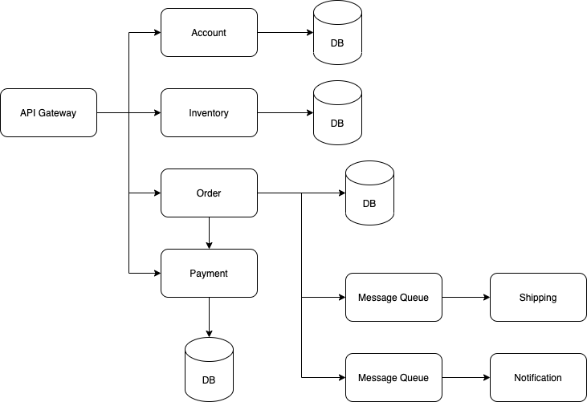

# Microservices Workshop

E-commerce microservices example for online course at [FutureSkill](https://futureskill.co)

## User Journey

### Customer

* Register new account
* View customer profile
* Update customer profile
* Search product catalog
* Get product recommendation
* Add item to cart
* Remove item from cart
* Create order
* View order
* Get notification

### Admin

* Update product catalog
* View shipping information
* Update shipping information

## Services

* Account
* Inventory
* Order
* Payment
* Notification
* Shipping

## Architecture

## Workshop 1

## Workshop 2
